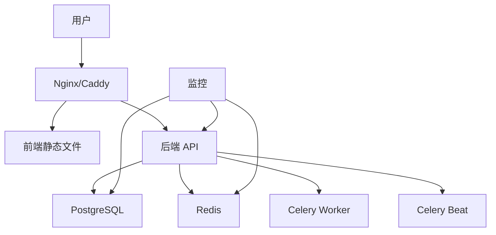

# Deployment Guide - AI Muse Blog

本文档提供 AI Muse Blog 项目的详细部署指南，涵盖从开发到生产环境的完整部署流程。

## 目录

- [部署概述](#部署概述)
- [环境准备](#环境准备)
- [Docker 部署](#docker-部署)
- [云平台部署](#云平台部署)
- [生产环境配置](#生产环境配置)
- [监控与日志](#监控与日志)
- [备份与恢复](#备份与恢复)
- [性能优化](#性能优化)
- [安全加固](#安全加固)

## 部署概述

### 部署架构



### 部署选项

1. **Docker Compose** (推荐入门)
2. **云平台** (Vercel, Railway, Render)
3. **VPS** (DigitalOcean, AWS, GCP)
4. **Kubernetes** (大规模部署)

## 环境准备

### 服务器要求

#### 最小配置
- CPU: 2 核
- 内存: 4GB
- 存储: 40GB SSD
- 操作系统: Ubuntu 22.04 LTS 或更新版本

#### 推荐配置
- CPU: 4 核
- 内存: 8GB
- 存储: 100GB SSD
- 操作系统: Ubuntu 22.04 LTS

### 必需软件

```bash
# 更新系统
sudo apt update && sudo apt upgrade -y

# 安装 Docker
curl -fsSL https://get.docker.com -o get-docker.sh
sudo sh get-docker.sh

# 安装 Docker Compose
sudo apt install docker-compose-plugin -y

# 验证安装
docker --version
docker compose version
```

## Docker 部署

### 1. 准备代码

```bash
# 克隆仓库
git clone <repository-url>
cd ai-muse-blog

# 复制环境变量文件
cp .env.example .env
cp backend/.env.example backend/.env
cp ai-muse-blog/.env.example ai-muse-blog/.env
```

### 2. 配置环境变量

编辑 `.env` 文件：

```env
# Database
POSTGRES_USER=aimuse
POSTGRES_PASSWORD=your-strong-password-here-change-me
POSTGRES_DB=ai_muse_blog

# JWT - 必须更改！使用 openssl rand -hex 32 生成
SECRET_KEY=your-secret-key-here-change-me

# Application
APP_NAME=AI Muse Blog
APP_VERSION=1.0.0
DEBUG=False
ENVIRONMENT=production

# CORS - 设置为你的域名
CORS_ORIGINS=["https://your-domain.com"]

# Email (可选)
SMTP_HOST=smtp.gmail.com
SMTP_PORT=587
SMTP_USER=your-email@gmail.com
SMTP_PASSWORD=your-app-password
```

生成安全的 SECRET_KEY：

```bash
openssl rand -hex 32
```

### 3. 构建镜像

```bash
# 构建所有镜像
docker compose build

# 查看镜像
docker images
```

### 4. 启动服务

```bash
# 启动所有服务（后台运行）
docker compose up -d

# 查看运行状态
docker compose ps

# 查看日志
docker compose logs -f

# 查看特定服务日志
docker compose logs -f backend
docker compose logs -f frontend
```

### 5. 初始化数据库

```bash
# 运行数据库迁移
docker compose exec backend alembic upgrade head

# 创建管理员用户（可选）
docker compose exec backend python -c "
from app.core.database import SessionLocal
from app.models.user import User
from app.core.security import get_password_hash

db = SessionLocal()
admin = User(
    email='admin@example.com',
    username='admin',
    hashed_password=get_password_hash('admin-password'),
    is_active=True,
    is_superuser=True
)
db.add(admin)
db.commit()
print('Admin user created')
"
```

### 6. 验证部署

```bash
# 检查所有服务是否运行
docker compose ps

# 测试后端 API
curl http://localhost:8000/health

# 访问前端
# 打开浏览器访问 http://your-server-ip
```

### 7. 配置反向代理

#### 使用 Nginx

```bash
# 安装 Nginx
sudo apt install nginx -y

# 创建配置文件
sudo nano /etc/nginx/sites-available/ai-muse-blog
```

Nginx 配置：

```nginx
# HTTP - 重定向到 HTTPS
server {
    listen 80;
    server_name your-domain.com;

    location / {
        return 301 https://$server_name$request_uri;
    }
}

# HTTPS
server {
    listen 443 ssl http2;
    server_name your-domain.com;

    # SSL 证书（使用 Let's Encrypt）
    ssl_certificate /etc/letsencrypt/live/your-domain.com/fullchain.pem;
    ssl_certificate_key /etc/letsencrypt/live/your-domain.com/privkey.pem;

    # SSL 配置
    ssl_protocols TLSv1.2 TLSv1.3;
    ssl_ciphers HIGH:!aNULL:!MD5;
    ssl_prefer_server_ciphers on;

    # 前端
    location / {
        proxy_pass http://localhost:80;
        proxy_set_header Host $host;
        proxy_set_header X-Real-IP $remote_addr;
        proxy_set_header X-Forwarded-For $proxy_add_x_forwarded_for;
        proxy_set_header X-Forwarded-Proto $scheme;
    }

    # 后端 API
    location /api/ {
        proxy_pass http://localhost:8000;
        proxy_set_header Host $host;
        proxy_set_header X-Real-IP $remote_addr;
        proxy_set_header X-Forwarded-For $proxy_add_x_forwarded_for;
        proxy_set_header X-Forwarded-Proto $scheme;

        # WebSocket 支持
        proxy_http_version 1.1;
        proxy_set_header Upgrade $http_upgrade;
        proxy_set_header Connection "upgrade";
    }

    # 文件上传大小限制
    client_max_body_size 10M;
}
```

启用配置：

```bash
# 创建符号链接
sudo ln -s /etc/nginx/sites-available/ai-muse-blog /etc/nginx/sites-enabled/

# 测试配置
sudo nginx -t

# 重启 Nginx
sudo systemctl restart nginx
```

#### 使用 Caddy（自动 HTTPS）

```bash
# 安装 Caddy
sudo apt install -y debian-keyring debian-archive-keyring apt-transport-https
curl -1sLf 'https://dl.cloudsmith.io/public/caddy/stable/gpg.key' | sudo gpg --dearmor -o /usr/share/keyrings/caddy-stable-archive-keyring.gpg
curl -1sLf 'https://dl.cloudsmith.io/public/caddy/stable/debian.deb.txt' | sudo tee /etc/apt/sources.list.d/caddy-stable.list
sudo apt update
sudo apt install caddy
```

Caddyfile：

```caddy
# /etc/caddy/Caddyfile
your-domain.com {
    reverse_proxy localhost:80

    handle_path /api/* {
        reverse_proxy localhost:8000
    }

    log {
        output file /var/log/caddy/ai-muse-blog.log
    }
}
```

### 8. 配置 SSL（使用 Let's Encrypt）

```bash
# 安装 Certbot
sudo apt install certbot python3-certbot-nginx -y

# 获取证书
sudo certbot --nginx -d your-domain.com

# 自动续期（已自动配置）
sudo certbot renew --dry-run
```

### 9. 配置防火墙

```bash
# 允许 SSH
sudo ufw allow 22/tcp

# 允许 HTTP/HTTPS
sudo ufw allow 80/tcp
sudo ufw allow 443/tcp

# 启用防火墙
sudo ufw enable

# 查看状态
sudo ufw status
```

## 云平台部署

### Railway

1. **连接 GitHub 仓库**
   - 访问 [railway.app](https://railway.app/)
   - 点击 "New Project" → "Deploy from GitHub repo"

2. **配置服务**
   - Railway 会自动检测 Dockerfile
   - 设置环境变量
   - 部署 PostgreSQL 和 Redis

3. **环境变量**
   ```env
   DATABASE_URL=${{Postgres.DATABASE_URL}}
   REDIS_URL=${{Redis.REDIS_URL}}
   SECRET_KEY=your-secret-key
   ```

### Render

1. **Web Service**
   - 创建 "Web Service"
   - 连接 GitHub 仓库
   - 设置构建命令：`docker build -f ai-muse-blog/Dockerfile .`
   - 设置启动命令：`docker run -p 80:80`

2. **Database**
   - 创建 "PostgreSQL"
   - 创建 "Redis"

### Vercel (仅前端)

```bash
# 安装 Vercel CLI
npm i -g vercel

# 登录
vercel login

# 部署
cd ai-muse-blog
vercel

# 生产环境
vercel --prod
```

## 生产环境配置

### 1. 数据库优化

#### PostgreSQL 配置

```bash
# 编辑 postgresql.conf
sudo nano /etc/postgresql/15/main/postgresql.conf
```

关键配置：

```ini
# 内存设置
shared_buffers = 256MB
effective_cache_size = 1GB
maintenance_work_mem = 64MB
work_mem = 16MB

# 连接设置
max_connections = 100

# WAL 设置
wal_buffers = 16MB
checkpoint_completion_target = 0.9

# 查询优化
random_page_cost = 1.1  # SSD
effective_io_concurrency = 200

# 日志
log_min_duration_statement = 1000  # 记录慢查询
```

#### 数据库索引

```sql
-- 创建索引
CREATE INDEX idx_articles_author ON articles(author_id);
CREATE INDEX idx_articles_status_created ON articles(status, created_at DESC);
CREATE INDEX idx_articles_slug ON articles(slug);
CREATE INDEX idx_comments_article ON comments(article_id);
CREATE INDEX idx_likes_user_article ON likes(user_id, article_id);

-- 全文搜索索引
CREATE INDEX idx_articles_search ON articles USING gin(to_tsvector('english', title || ' ' || content));
```

### 2. Redis 配置

```bash
# 编辑 redis.conf
sudo nano /etc/redis/redis.conf
```

关键配置：

```ini
# 内存
maxmemory 512mb
maxmemory-policy allkeys-lru

# 持久化
save 900 1
save 300 10
save 60 10000

# 日志
loglevel notice
logfile /var/log/redis/redis-server.log
```

### 3. 后端优化

#### Gunicorn 配置

创建 `gunicorn.conf.py`：

```python
# backend/gunicorn.conf.py
import multiprocessing

bind = "0.0.0.0:8000"
workers = multiprocessing.cpu_count() * 2 + 1
worker_class = "uvicorn.workers.UvicornWorker"
worker_connections = 1000
max_requests = 1000
max_requests_jitter = 100
timeout = 30
keepalive = 2
preload_app = True
```

启动命令：

```bash
gunicorn app.main:app -c gunicorn.conf.py
```

#### Celery 配置

```python
# backend/celeryconfig.py
from celery import Celery

app = Celery('ai_muse_blog')

app.conf.update(
    # Worker
    worker_prefetch_multiplier=4,
    worker_max_tasks_per_child=1000,

    # Task
    task_acks_late=True,
    task_reject_on_worker_lost=True,
    task_time_limit=30 * 60,  # 30 分钟

    # Result
    result_expires=3600,
    result_backend='redis://localhost:6379/1',

    # Broker
    broker_url='redis://localhost:6379/0',
    broker_connection_retry_on_startup=True,
)
```

### 4. 前端优化

#### 生产构建

```bash
# 构建优化版本
cd ai-muse-blog
npm run build

# 分析构建产物
npm run build -- --mode analyze
```

#### Vite 配置优化

```typescript
// vite.config.ts
export default defineConfig({
  build: {
    outDir: 'dist',
    sourcemap: false,
    minify: 'terser',
    rollupOptions: {
      output: {
        manualChunks: {
          'vendor': ['react', 'react-dom'],
          'router': ['react-router-dom'],
          'ui': ['@radix-ui/react-dialog', '@radix-ui/react-dropdown-menu'],
        },
      },
    },
    chunkSizeWarningLimit: 1000,
  },
});
```

## 监控与日志

### 1. 日志管理

#### 后端日志配置

```python
# backend/app/core/logging.py
import logging
from logging.handlers import RotatingFileHandler
import os

def setup_logging():
    log_dir = "logs"
    os.makedirs(log_dir, exist_ok=True)

    # 应用日志
    app_handler = RotatingFileHandler(
        f"{log_dir}/app.log",
        maxBytes=10 * 1024 * 1024,  # 10MB
        backupCount=10
    )
    app_handler.setFormatter(logging.Formatter(
        '%(asctime)s - %(name)s - %(levelname)s - %(message)s'
    ))

    # 错误日志
    error_handler = RotatingFileHandler(
        f"{log_dir}/error.log",
        maxBytes=10 * 1024 * 1024,
        backupCount=10
    )
    error_handler.setLevel(logging.ERROR)
    error_handler.setFormatter(logging.Formatter(
        '%(asctime)s - %(name)s - %(levelname)s - %(pathname)s:%(lineno)d - %(message)s'
    ))

    logging.basicConfig(
        level=logging.INFO,
        handlers=[app_handler, error_handler, logging.StreamHandler()]
    )
```

### 2. 监控工具

#### 使用 Prometheus + Grafana

```yaml
# docker-compose.monitoring.yml
version: '3.8'

services:
  prometheus:
    image: prom/prometheus
    volumes:
      - ./prometheus.yml:/etc/prometheus/prometheus.yml
    ports:
      - "9090:9090"

  grafana:
    image: grafana/grafana
    ports:
      - "3001:3000"
    environment:
      - GF_SECURITY_ADMIN_PASSWORD=admin
```

#### 使用 Sentry（错误追踪）

```python
# backend/app/main.py
import sentry_sdk
from sentry_sdk.integrations.fastapi import FastApiIntegration

sentry_sdk.init(
    dsn="your-sentry-dsn",
    integrations=[FastApiIntegration()],
    traces_sample_rate=1.0,
)
```

### 3. 健康检查

```python
# backend/app/api/v1/health.py
from fastapi import APIRouter, Depends
from sqlalchemy.orm import Session
from app.core.database import get_db
import redis

router = APIRouter()

@router.get("/health")
def health_check(db: Session = Depends(get_db)):
    checks = {
        "status": "healthy",
        "database": check_database(db),
        "redis": check_redis(),
    }

    if all(checks.values()):
        return checks
    return {"status": "unhealthy", **checks}, 503

def check_database(db: Session) -> bool:
    try:
        db.execute("SELECT 1")
        return True
    except:
        return False

def check_redis() -> bool:
    try:
        r = redis.Redis(host='localhost', port=6379)
        r.ping()
        return True
    except:
        return False
```

## 备份与恢复

### 1. 数据库备份

#### 自动备份脚本

```bash
#!/bin/bash
# backup.sh

DATE=$(date +%Y%m%d_%H%M%S)
BACKUP_DIR="/backups"
DB_NAME="ai_muse_blog"
DB_USER="postgres"

# 创建备份目录
mkdir -p $BACKUP_DIR

# 备份数据库
docker compose exec -T postgres pg_dump -U $DB_USER $DB_NAME > $BACKUP_DIR/db_$DATE.sql

# 压缩备份
gzip $BACKUP_DIR/db_$DATE.sql

# 删除 30 天前的备份
find $BACKUP_DIR -name "db_*.sql.gz" -mtime +30 -delete

echo "Backup completed: db_$DATE.sql.gz"
```

#### 设置定时任务

```bash
# 编辑 crontab
crontab -e

# 每天凌晨 2 点备份
0 2 * * * /path/to/backup.sh >> /var/log/backup.log 2>&1
```

### 2. 恢复数据库

```bash
# 解压备份
gunzip /backups/db_20240101_020000.sql.gz

# 恢复数据库
docker compose exec -T postgres psql -U postgres -d ai_muse_blog < /backups/db_20240101_020000.sql
```

### 3. 文件备份

```bash
# 备份上传的文件
rsync -avz /path/to/uploads/ /backups/uploads/

# 使用 rclone 备份到云存储
rclone sync /backups/ remote:ai-muse-blog-backups
```

## 性能优化

### 1. CDN 配置

使用 CloudFlare CDN：

1. 添加域名到 CloudFlare
2. 修改 NS 记录
3. 配置缓存规则
4. 启用 Auto Minify

### 2. 静态资源优化

```typescript
// 图片优化
import Image from 'next/image';

<Image
  src="/logo.png"
  alt="Logo"
  width={200}
  height={100}
  loading="lazy"
  placeholder="blur"
/>
```

### 3. 数据库查询优化

```python
# 使用 select_related 减少 JOIN 查询
articles = db.query(Article)\
    .options(joinedload(Article.author))\
    .options(joinedload(Article.tags))\
    .all()

# 使用只查询需要的字段
articles = db.query(Article.id, Article.title, Article.created_at).all()
```

## 安全加固

### 1. 系统安全

```bash
# 禁用 root 登录
sudo sed -i 's/PermitRootLogin yes/PermitRootLogin no/' /etc/ssh/sshd_config

# 禁用密码登录（仅密钥）
sudo sed -i 's/PasswordAuthentication yes/PasswordAuthentication no/' /etc/ssh/sshd_config

# 重启 SSH
sudo systemctl restart sshd

# 安装 fail2ban
sudo apt install fail2ban -y
```

### 2. 应用安全

```python
# 设置安全头
from fastapi.middleware.trustedhost import TrustedHostMiddleware
from starlette.middleware.csrf import CSRFMiddleware

app.add_middleware(
    TrustedHostMiddleware,
    allowed_hosts=["your-domain.com", "*.your-domain.com"]
)

app.add_middleware(
    CSRFMiddleware,
    secret=os.getenv("SECRET_KEY")
)
```

### 3. Docker 安全

```yaml
# docker-compose.yml
services:
  backend:
    security_opt:
      - no-new-privileges:true
    read_only: true
    tmpfs:
      - /tmp
    cap_drop:
      - ALL
    cap_add:
      - NET_BIND_SERVICE
```

### 4. 环境变量管理

```bash
# 使用 Docker Secrets
echo "your-secret-key" | docker secret create secret_key -

# 在 docker-compose.yml 中使用
services:
  backend:
    secrets:
      - secret_key
    environment:
      SECRET_KEY_FILE: /run/secrets/secret_key

secrets:
  secret_key:
    external: true
```

## 故障排除

### 常见问题

**1. 容器无法启动**

```bash
# 查看日志
docker compose logs backend

# 检查配置
docker compose config

# 重建容器
docker compose up -d --build --force-recreate
```

**2. 数据库连接失败**

```bash
# 检查数据库是否运行
docker compose ps postgres

# 测试连接
docker compose exec postgres psql -U postgres -d ai_muse_blog

# 检查网络
docker network inspect ai-muse-network
```

**3. 前端 API 请求失败**

```bash
# 检查 CORS 配置
# 查看浏览器 Console
# 检查后端日志
docker compose logs backend | grep CORS
```

**4. 内存不足**

```bash
# 查看容器资源使用
docker stats

# 限制内存使用
# 在 docker-compose.yml 中添加
services:
  backend:
    deploy:
      resources:
        limits:
          memory: 1G
```

## 更新部署

### 滚动更新

```bash
# 拉取最新代码
git pull origin main

# 重建镜像
docker compose build

# 重启服务（零停机）
docker compose up -d --no-deps --build backend

# 等待健康检查
sleep 30

# 重启前端
docker compose up -d --no-deps --build frontend
```

### 数据库迁移

```bash
# 备份数据库
./backup.sh

# 运行迁移
docker compose exec backend alembic upgrade head

# 验证
docker compose exec backend alembic current
```

## 费用估算

### 月度成本（小型部署）

| 服务 | 规格 | 月费用 |
|------|------|--------|
| VPS (DigitalOcean) | 4GB RAM, 2 CPU, 80GB SSD | $24 |
| 域名 | .com | $12/年 = $1 |
| SSL | Let's Encrypt | 免费 |
| CDN (CloudFlare) | 免费版 | 免费 |
| **总计** | | **~$25/月** |

### 云平台成本

| 平台 | 月费用（小型） |
|------|----------------|
| Railway | $20-50 |
| Render | $25-70 |
| Heroku | $50-100 |
| AWS | $30-80 |

## 资源链接

- [Docker 文档](https://docs.docker.com/)
- [Nginx 文档](https://nginx.org/en/docs/)
- [PostgreSQL 文档](https://www.postgresql.org/docs/)
- [Let's Encrypt](https://letsencrypt.org/)
- [CloudFlare](https://developers.cloudflare.com/)

---

**祝部署顺利！** 🚀
