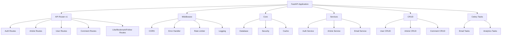
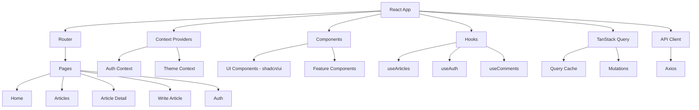

# Development Guide - AI Muse Blog

本文档提供 AI Muse Blog 项目的详细开发指南，包括开发环境设置、代码规范、测试策略和最佳实践。

## 目录

- [开发环境设置](#开发环境设置)
- [后端开发](#后端开发)
- [前端开发](#前端开发)
- [代码规范](#代码规范)
- [测试](#测试)
- [调试](#调试)
- [性能优化](#性能优化)
- [安全最佳实践](#安全最佳实践)

## 开发环境设置

### 必需工具

#### 基础工具
- **Git**: 版本控制
- **Docker**: 容器化（推荐）
- **VS Code**: 推荐的 IDE

#### 后端开发工具
- **Python 3.11+**: 编程语言
- **Poetry 或 pip**: 依赖管理
- **PostgreSQL 15+**: 数据库
- **Redis 7+**: 缓存（可选）
- **Postman**: API 测试

#### 前端开发工具
- **Node.js 18+**: JavaScript 运行时
- **npm 或 bun**: 包管理器
- **浏览器**: Chrome/Edge/Firefox（带 DevTools）

### 推荐的 VS Code 扩展

```json
{
  "recommendations": [
    "ms-python.python",
    "ms-python.vscode-pylance",
    "ms-python.black-formatter",
    "dbaeumer.vscode-eslint",
    "bradlc.vscode-tailwindcss",
    "esbenp.prettier-vscode",
    "ms-vscode.vscode-typescript-next",
    "GitHub.copilot",
    "ms-azuretools.vscode-docker",
    "humao.rest-client"
  ]
}
```

### 环境配置

#### 1. 克隆项目

```bash
git clone <repository-url>
cd ai-muse-blog
```

#### 2. 配置环境变量

```bash
# 复制环境变量模板
cp .env.example .env
cp backend/.env.example backend/.env
cp ai-muse-blog/.env.example ai-muse-blog/.env

# 编辑各 .env 文件，设置必要的变量
```

#### 3. 启动开发环境

使用 Docker Compose（推荐）：

```bash
# 启动所有服务
docker-compose up -d

# 查看日志
docker-compose logs -f

# 停止服务
docker-compose down
```

或手动启动各个服务：

```bash
# 启动后端
cd backend
python -m venv venv
source venv/bin/activate  # Windows: venv\Scripts\activate
pip install -r requirements.txt
alembic upgrade head
python -m app.main

# 启动前端（新终端）
cd ai-muse-blog
npm install
npm run dev
```

## 后端开发

### 项目架构



### 添加新的 API 端点

#### 步骤 1: 定义数据模型

在 `backend/app/models/` 中创建模型：

```python
# backend/app/models/product.py
from sqlalchemy import Column, Integer, String, Text, DateTime
from sqlalchemy.sql import func
from app.core.database import Base

class Product(Base):
    __tablename__ = "products"

    id = Column(Integer, primary_key=True, index=True)
    name = Column(String(200), nullable=False)
    description = Column(Text)
    price = Column(Integer, nullable=False)
    created_at = Column(DateTime(timezone=True), server_default=func.now())
    updated_at = Column(DateTime(timezone=True), onupdate=func.now())
```

#### 步骤 2: 创建 Pydantic Schema

在 `backend/app/schemas/` 中创建 schema：

```python
# backend/app/schemas/product.py
from pydantic import BaseModel, Field
from datetime import datetime

class ProductBase(BaseModel):
    name: str = Field(..., max_length=200)
    description: str | None = None
    price: int = Field(..., gt=0)

class ProductCreate(ProductBase):
    pass

class ProductUpdate(ProductBase):
    name: str | None = None
    price: int | None = None

class Product(ProductBase):
    id: int
    created_at: datetime
    updated_at: datetime | None = None

    class Config:
        from_attributes = True

class ProductList(BaseModel):
    items: list[Product]
    total: int
    page: int
    page_size: int
    total_pages: int
```

#### 步骤 3: 实现 CRUD 操作

在 `backend/app/crud/` 中创建 CRUD：

```python
# backend/app/crud/product.py
from sqlalchemy.orm import Session
from sqlalchemy import desc
from typing import Optional
from app.models.product import Product
from app.schemas.product import ProductCreate, ProductUpdate

def get(db: Session, id: int) -> Optional[Product]:
    return db.query(Product).filter(Product.id == id).first()

def get_multi(
    db: Session,
    skip: int = 0,
    limit: int = 100,
    sort_by: str = "created_at"
):
    query = db.query(Product)
    if sort_by == "created_at":
        query = query.order_by(desc(Product.created_at))
    return query.offset(skip).limit(limit).all()

def create(db: Session, obj_in: ProductCreate) -> Product:
    db_obj = Product(**obj_in.model_dump())
    db.add(db_obj)
    db.commit()
    db.refresh(db_obj)
    return db_obj

def update(db: Session, db_obj: Product, obj_in: ProductUpdate) -> Product:
    obj_data = obj_in.model_dump(exclude_unset=True)
    for field, value in obj_data.items():
        setattr(db_obj, field, value)
    db.add(db_obj)
    db.commit()
    db.refresh(db_obj)
    return db_obj

def delete(db: Session, id: int) -> Product:
    obj = db.query(Product).get(id)
    db.delete(obj)
    db.commit()
    return obj
```

#### 步骤 4: 创建 API 路由

在 `backend/app/api/v1/` 中创建路由：

```python
# backend/app/api/v1/products.py
from fastapi import APIRouter, Depends, HTTPException, Query
from sqlalchemy.orm import Session
from typing import Optional
from app.core.database import get_db
from app.schemas.product import Product, ProductCreate, ProductUpdate, ProductList
from app.crud import product as crud_product
from app.api.v1.router import get_current_user

router = APIRouter()

@router.get("", response_model=ProductList)
def list_products(
    page: int = Query(1, ge=1),
    page_size: int = Query(10, ge=1, le=100),
    db: Session = Depends(get_db)
):
    skip = (page - 1) * page_size
    items = crud_product.get_multi(db, skip=skip, limit=page_size)
    total = len(items)  # 简化示例，实际应使用 count()
    return ProductList(
        items=items,
        total=total,
        page=page,
        page_size=page_size,
        total_pages=(total + page_size - 1) // page_size
    )

@router.get("/{product_id}", response_model=Product)
def get_product(product_id: int, db: Session = Depends(get_db)):
    product = crud_product.get(db, id=product_id)
    if not product:
        raise HTTPException(status_code=404, detail="Product not found")
    return product

@router.post("", response_model=Product, status_code=201)
def create_product(
    product_in: ProductCreate,
    db: Session = Depends(get_db),
    current_user = Depends(get_current_user)
):
    return crud_product.create(db, product_in)

@router.put("/{product_id}", response_model=Product)
def update_product(
    product_id: int,
    product_in: ProductUpdate,
    db: Session = Depends(get_db),
    current_user = Depends(get_current_user)
):
    product = crud_product.get(db, id=product_id)
    if not product:
        raise HTTPException(status_code=404, detail="Product not found")
    return crud_product.update(db, product, product_in)

@router.delete("/{product_id}", status_code=204)
def delete_product(
    product_id: int,
    db: Session = Depends(get_db),
    current_user = Depends(get_current_user)
):
    product = crud_product.get(db, id=product_id)
    if not product:
        raise HTTPException(status_code=404, detail="Product not found")
    crud_product.delete(db, id=product_id)
    return None
```

#### 步骤 5: 注册路由

在 `backend/app/api/v1/router.py` 中注册：

```python
from app.api.v1 import products

api_router.include_router(
    products.router,
    prefix="/products",
    tags=["products"]
)
```

#### 步骤 6: 创建数据库迁移

```bash
cd backend
alembic revision --autogenerate -m "Add products table"
alembic upgrade head
```

### 数据库迁移

```bash
# 创建新迁移
alembic revision --autogenerate -m "Description of changes"

# 应用迁移
alembic upgrade head

# 回滚迁移
alembic downgrade -1

# 查看迁移历史
alembic history

# 查看当前版本
alembic current
```

### 后端测试

```bash
cd backend

# 运行所有测试
pytest

# 运行特定文件
pytest tests/test_auth.py

# 运行特定测试
pytest tests/test_auth.py::test_login

# 查看覆盖率
pytest --cov=app --cov-report=html

# 详细输出
pytest -v

# 只运行标记的测试
pytest -m "not slow"
```

## 前端开发

### 项目架构



### 添加新页面

#### 步骤 1: 创建页面组件

```tsx
// src/pages/Products.tsx
import { useState } from 'react';
import { useProducts } from '@/hooks';
import { Button } from '@/components/ui/button';

export function Products() {
  const [page, setPage] = useState(1);
  const { data, isLoading, error } = useProducts({ page, page_size: 10 });

  if (isLoading) return <div>Loading...</div>;
  if (error) return <div>Error loading products</div>;

  return (
    <div className="container mx-auto py-8">
      <h1 className="text-3xl font-bold mb-6">Products</h1>
      <div className="grid grid-cols-1 md:grid-cols-2 lg:grid-cols-3 gap-4">
        {data?.items.map((product) => (
          <div key={product.id} className="border rounded-lg p-4">
            <h3 className="font-semibold">{product.name}</h3>
            <p className="text-sm text-gray-600">{product.description}</p>
            <p className="text-lg font-bold mt-2">${product.price}</p>
          </div>
        ))}
      </div>
      <div className="mt-6 flex gap-2">
        <Button
          onClick={() => setPage(p => Math.max(1, p - 1))}
          disabled={page === 1}
        >
          Previous
        </Button>
        <Button
          onClick={() => setPage(p => p + 1)}
          disabled={page >= (data?.total_pages || 1)}
        >
          Next
        </Button>
      </div>
    </div>
  );
}
```

#### 步骤 2: 添加路由

```tsx
// src/App.tsx
import { Products } from '@/pages/Products';

// 在路由配置中添加
<Route path="/products" element={<Products />} />
```

### 创建自定义 Hook

```tsx
// src/hooks/useProducts.ts
import { useQuery, useMutation, useQueryClient } from '@tanstack/react-query';
import { api, Product, ProductCreate, ProductUpdate } from '@/types/api';

export function useProducts(params?: { page?: number; page_size?: number }) {
  return useQuery({
    queryKey: ['products', params],
    queryFn: () => api.products.list(params || {}),
  });
}

export function useProduct(id: string) {
  return useQuery({
    queryKey: ['products', id],
    queryFn: () => api.products.get(id),
    enabled: !!id,
  });
}

export function useCreateProduct() {
  const queryClient = useQueryClient();
  return useMutation({
    mutationFn: (data: ProductCreate) => api.products.create(data),
    onSuccess: () => {
      queryClient.invalidateQueries({ queryKey: ['products'] });
    },
  });
}

export function useUpdateProduct() {
  const queryClient = useQueryClient();
  return useMutation({
    mutationFn: ({ id, data }: { id: string; data: ProductUpdate }) =>
      api.products.update(id, data),
    onSuccess: (_, variables) => {
      queryClient.invalidateQueries({ queryKey: ['products'] });
      queryClient.invalidateQueries({ queryKey: ['products', variables.id] });
    },
  });
}

export function useDeleteProduct() {
  const queryClient = useQueryClient();
  return useMutation({
    mutationFn: (id: string) => api.products.delete(id),
    onSuccess: () => {
      queryClient.invalidateQueries({ queryKey: ['products'] });
    },
  });
}
```

### 添加 API 端点

```typescript
// src/lib/api.ts
export const api = {
  // ... existing endpoints
  products: {
    list: (params?: { page?: number; page_size?: number }) =>
      apiClient.get<ProductList>('/products', { params }),
    get: (id: string) => apiClient.get<Product>(`/products/${id}`),
    create: (data: ProductCreate) => apiClient.post<Product>('/products', data),
    update: (id: string, data: ProductUpdate) =>
      apiClient.put<Product>(`/products/${id}`, data),
    delete: (id: string) => apiClient.delete(`/products/${id}`),
  },
};
```

### 添加 TypeScript 类型

```typescript
// src/types/api.ts
export interface Product {
  id: number;
  name: string;
  description: string | null;
  price: number;
  created_at: string;
  updated_at: string | null;
}

export interface ProductCreate {
  name: string;
  description?: string;
  price: number;
}

export interface ProductUpdate {
  name?: string;
  description?: string;
  price?: number;
}

export interface ProductList {
  items: Product[];
  total: number;
  page: number;
  page_size: number;
  total_pages: number;
}
```

## 代码规范

### Python 代码规范

#### 格式化

使用 Black 自动格式化代码：

```bash
# 格式化所有代码
black app/ tests/

# 检查格式（不修改）
black --check app/ tests/
```

#### 代码检查

使用 Flake8 检查代码质量：

```bash
# 运行 flake8
flake8 app/ tests/

# 配置示例 (.flake8)
[flake8]
max-line-length = 88
extend-ignore = E203, W503
exclude = .git,__pycache__,venv
```

#### 类型检查

使用 mypy 进行类型检查：

```bash
# 运行 mypy
mypy app/

# 配置示例 (mypy.ini)
[mypy]
python_version = 3.11
warn_return_any = True
warn_unused_configs = True
disallow_untyped_defs = True
```

### TypeScript/React 代码规范

#### ESLint 配置

```bash
# 运行 lint
npm run lint

# 自动修复
npm run lint -- --fix
```

#### 代码风格指南

1. **组件命名**: 使用 PascalCase
2. **文件命名**: 组件使用 PascalCase，工具函数使用 camelCase
3. **Hook 命名**: 必须以 "use" 开头
4. **类型定义**: 使用 interface 定义对象类型，type 定义联合类型

```typescript
// Good
interface User {
  id: string;
  name: string;
}

type Status = 'pending' | 'success' | 'error';

function useUserData() {
  // ...
}

export function UserProfile() {
  // ...
}
```

### Git 提交规范

使用 Conventional Commits：

```
<type>(<scope>): <subject>

<body>

<footer>
```

**类型 (type):**
- `feat`: 新功能
- `fix`: 修复 bug
- `docs`: 文档更新
- `style`: 代码格式（不影响代码运行）
- `refactor`: 重构
- `test`: 测试
- `chore`: 构建过程或辅助工具的变动

**示例:**

```bash
feat(backend): add product management API

- Add Product model with name, description, price
- Implement CRUD operations
- Add API endpoints for products
- Write unit tests

Closes #123
```

## 测试

### 后端测试

#### 单元测试示例

```python
# tests/test_products.py
import pytest
from fastapi.testclient import TestClient
from app.main import app

client = TestClient(app)

def test_list_products():
    response = client.get("/api/v1/products")
    assert response.status_code == 200
    data = response.json()
    assert "items" in data
    assert "total" in data

def test_create_product(auth_headers):
    product_data = {
        "name": "Test Product",
        "description": "Test Description",
        "price": 100
    }
    response = client.post(
        "/api/v1/products",
        json=product_data,
        headers=auth_headers
    )
    assert response.status_code == 201
    data = response.json()
    assert data["name"] == "Test Product"
    assert data["price"] == 100

@pytest.fixture
def auth_headers():
    # Login and get token
    response = client.post("/api/v1/auth/login", json={
        "email": "test@example.com",
        "password": "testpass"
    })
    token = response.json()["access_token"]
    return {"Authorization": f"Bearer {token}"}
```

### 前端测试

#### 组件测试示例

```tsx
// src/components/__tests__/ProductCard.test.tsx
import { render, screen } from '@testing-library/react';
import { ProductCard } from '../ProductCard';

describe('ProductCard', () => {
  const mockProduct = {
    id: 1,
    name: 'Test Product',
    description: 'Test Description',
    price: 100,
    created_at: '2024-01-01',
  };

  it('renders product information', () => {
    render(<ProductCard product={mockProduct} />);
    expect(screen.getByText('Test Product')).toBeInTheDocument();
    expect(screen.getByText('Test Description')).toBeInTheDocument();
    expect(screen.getByText('$100')).toBeInTheDocument();
  });
});
```

## 调试

### 后端调试

#### VS Code 配置

```json
// .vscode/launch.json
{
  "version": "0.2.0",
  "configurations": [
    {
      "name": "Python: FastAPI",
      "type": "debugpy",
      "request": "launch",
      "module": "uvicorn",
      "args": ["app.main:app", "--reload", "--host", "0.0.0.0", "--port", "8000"],
      "console": "integratedTerminal",
      "cwd": "${workspaceFolder}/backend"
    }
  ]
}
```

#### 日志记录

```python
import logging

logger = logging.getLogger(__name__)

@router.post("/products")
def create_product(product_in: ProductCreate, db: Session = Depends(get_db)):
    logger.info(f"Creating product: {product_in.name}")
    try:
        product = crud_product.create(db, product_in)
        logger.info(f"Product created with ID: {product.id}")
        return product
    except Exception as e:
        logger.error(f"Failed to create product: {e}")
        raise
```

### 前端调试

#### React Query DevTools

```tsx
// src/main.tsx
import { ReactQueryDevtools } from '@tanstack/react-query-devtools';

ReactDOM.createRoot(document.getElementById('root')!).render(
  <React.StrictMode>
    <QueryClientProvider client={queryClient}>
      <App />
      <ReactQueryDevtools initialIsOpen={false} />
    </QueryClientProvider>
  </React.StrictMode>
);
```

#### 浏览器 DevTools

1. **Network Tab**: 查看 API 请求
2. **Console**: 查看错误和日志
3. **React DevTools**: 检查组件状态和 props
4. **Redux DevTools**: 如使用 Redux

## 性能优化

### 后端优化

1. **数据库索引**
   - 为频繁查询的字段添加索引
   - 使用复合索引优化多字段查询

2. **查询优化**
   - 使用 `select_related` 和 `joinedload` 减少查询次数
   - 分页加载大数据集

3. **缓存**
   - 使用 Redis 缓存热点数据
   - 实现查询结果缓存

```python
from app.core.cache import cache_manager

@cache_manager.cache(ttl=300)  # 缓存 5 分钟
def get_popular_articles(db: Session, limit: int = 10):
    return db.query(Article).order_by(Article.views.desc()).limit(limit).all()
```

### 前端优化

1. **代码分割**
   ```tsx
   const WriteArticle = lazy(() => import('./pages/WriteArticle'));
   ```

2. **图片优化**
   ```tsx
   <Image src={url} alt={alt} loading="lazy" />
   ```

3. **React Query 优化**
   ```tsx
   const { data } = useQuery({
     queryKey: ['articles', page],
     queryFn: () => fetchArticles(page),
     staleTime: 5 * 60 * 1000, // 5 分钟
     cacheTime: 10 * 60 * 1000, // 10 分钟
   });
   ```

4. **虚拟滚动** - 用于长列表
   ```tsx
   import { useVirtualizer } from '@tanstack/react-virtual';
   ```

## 安全最佳实践

### 后端安全

1. **输入验证**
   ```python
   from pydantic import Field, validator

   class ArticleCreate(BaseModel):
       title: str = Field(..., min_length=1, max_length=200)
       content: str = Field(..., min_length=1)

       @validator('title')
       def title_must_not_contain_url(cls, v):
           if 'http' in v:
               raise ValueError('Title must not contain URLs')
           return v
   ```

2. **SQL 注入防护** - 使用 ORM 参数化查询

3. **XSS 防护** - 对用户输入进行转义

4. **CSRF 防护** - 使用 CSRF Token

5. **速率限制**
   ```python
   from slowapi import Limiter

   limiter = Limiter(key_func=get_remote_address)

   @router.post("/login")
   @limiter.limit("5/minute")
   async def login():
       pass
   ```

### 前端安全

1. **XSS 防护** - React 默认转义，使用 `dangerouslySetInnerHTML` 时需谨慎

2. **Content Security Policy**
   ```html
   <meta http-equiv="Content-Security-Policy"
         content="default-src 'self'; script-src 'self' 'unsafe-inline'">
   ```

3. **Token 存储** - 使用 httpOnly cookie 或 localStorage（各有优劣）

4. **HTTPS** - 生产环境必须使用

## 常见问题

### 后端

**Q: Alembic 迁移失败？**
```bash
# 查看当前状态
alembic current

# 回滚到之前版本
alembic downgrade base

# 重新生成迁移
alembic revision --autogenerate -m "fix"
alembic upgrade head
```

**Q: 数据库连接错误？**
- 检查 DATABASE_URL 是否正确
- 确认 PostgreSQL 服务正在运行
- 检查防火墙设置

### 前端

**Q: API 请求失败？**
- 检查 VITE_API_BASE_URL 配置
- 确认后端服务正在运行
- 检查 CORS 配置
- 查看浏览器 Console 和 Network tab

**Q: 组件不重新渲染？**
- 检查 React Query 的 queryKey 是否正确
- 确认是否使用了正确的依赖数组
- 使用 React DevTools 检查状态

## 资源

- [FastAPI 官方文档](https://fastapi.tiangolo.com/)
- [React 官方文档](https://react.dev/)
- [TanStack Query 文档](https://tanstack.com/query/latest)
- [shadcn/ui 文档](https://ui.shadcn.com/)
- [Tailwind CSS 文档](https://tailwindcss.com/)

---

**Happy Coding!** 🚀
